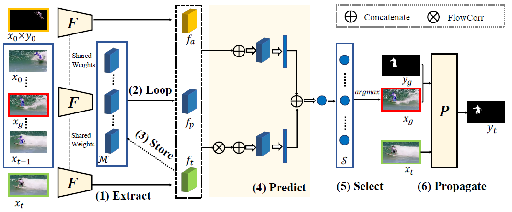

# Memory Selection Network for Video Propagation

This repository provides a PyTorch implementation of [MSN](https://www.ecva.net/papers/eccv_2020/papers_ECCV/papers/123600171.pdf).

<p align="center"></p>

<br/>

## Requirements

### STM

#### Selection

- Python 2.7
- Pytorch 0.3.1

#### Propagation
- Python 3.6
- Pytorch 1.0.1

### TPN

- Python 2.7
- Pytorch 0.3.1

## Usage

### Data Preparation
- [DAVIS](https://davischallenge.org)
- [YTVOS](https://competitions.codalab.org/competitions/19544#participate-get-data)
- [Data List](https://drive.google.com/drive/u/0/folders/1R3w8ho0xBJBw7v-Weq0KcRSdZk0W2RYK)

### Pretrained Models
- TPN pretrained models are stored in the [link](https://drive.google.com/drive/u/0/folders/11-co48qhrAoTegK60BUXOM2NInpvj1il)
- STM pretrained models: [[Selection](https://drive.google.com/drive/u/0/folders/1fU2hyj2OSmrueyJoJGVAehM4msxvzsXo)] [[Propagation](https://www.dropbox.com/s/mtfxdr93xc3q55i/STM_weights.pth?dl=1)]

### Scripts
- For STM, refer to [STM/README.md](STM/README.md)
- For TPN, refer to [TPN/README.md](TPN/README.md)

## Evaluation

- [YTVOS](https://competitions.codalab.org/competitions/19544#participate)  
- [DAVIS](https://github.com/fperazzi/davis-2017)

## Reference
If you use this code for your research, please cite our paper.
```
@inproceedings{wu2020memory,
  title={Memory Selection Network for Video Propagation},
  author={Wu, Ruizheng and Lin, Huaijia and Qi, Xiaojuan and Jia, Jiaya},
  booktitle={European Conference on Computer Vision},
  year={2020}
}
```

## Acknowledgments
Parts of this code were derived from [NVIDIA/flownet2-pytorch](https://github.com/NVIDIA/flownet2-pytorch) and [seoungwugoh/STM](https://github.com/seoungwugoh/STM).